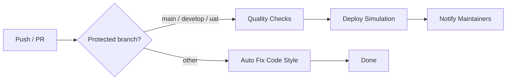

# CI/CD Pipeline

## Overview

This CI/CD pipeline automates quality checks, testing, and deployment simulation for the **Ochumelye** Laravel application. It is triggered on every push and pull request to the three long-lived branches: `main`, `develop`, and `uat`.

## Pipeline Structure



### Jobs

#### 0. Auto Fix Code Style (`jobs.lint-fix`)

Runs on **push to any non-protected branch** (not `main`, `develop`, or `uat`). Runs Laravel Pint in auto-fix mode and commits the changes back to the branch with `[skip ci]` in the commit message to avoid re-triggering the pipeline.

#### 1. Quality Checks (`jobs.quality`)

Runs on every push/PR to `main`, `develop`, or `uat`. Includes:

| Step | Tool | Description |
|------|------|-------------|
| **Linting** | Laravel Pint (PSR-12) | Runs in `--test` mode — fails if any code style violation is found |
| **Static Analysis** | PHPStan (Larastan) | Level 5 — fails on any error (not just warnings) |
| **Tests** | PHPUnit | Executes full test suite with code coverage |
| **Coverage Gate** | PHP script | Fails pipeline if code coverage < **50%** |

#### 2. Deploy Simulation (`jobs.deploy-simulation`)

Only runs if **all** Quality Checks pass. Copies the appropriate `.env` file and simulates deployment:

| Branch | Environment | `.env` file |
|--------|-------------|-------------|
| `develop` | Development | `.env.dev` |
| `uat` | UAT | `.env.uat` |
| `main` | Production | `.env.prod` |

For the `main` (production) branch, this job requires **manual approval** via GitHub Environments:
1. Go to repository **Settings → Environments → production**
2. Add **Required reviewers** (e.g., team leads)
3. Each deployment to `main` will pause until an approved reviewer confirms

#### 3. Notify Maintainers (`jobs.notify`)

Sends a notification with the pipeline result (status, branch, commit, run URL). Always runs, regardless of previous steps' outcome.

## Required Variables

Each `.env.*` file includes these mandatory variables:

| Variable | Description |
|----------|-------------|
| `APP_NAME` | Application name |
| `APP_ENV` | Environment identifier |
| `APP_DEBUG` | Debug mode (true/false) |
| `APP_URL` | Application base URL |
| `APP_KEY` | Laravel app key (may be blank — generate via `php artisan key:generate`) |
| `DB_CONNECTION` | Database driver (mysql/sqlite) |
| `DB_HOST` | Database host |
| `DB_PORT` | Database port |
| `DB_DATABASE` | Database name |
| `DB_USERNAME` | Database user |
| `DB_PASSWORD` | Database password |

## Pipeline Configuration

**File:** `.github/workflows/ci.yml`

### Trigger

```yaml
on:
  push:
    branches: [main, develop, uat]
  pull_request:
    branches: [main, develop, uat]
```

### Environment Setup

- **PHP 8.3** with extensions: dom, curl, libxml, mbstring, zip, pcntl, pdo, sqlite, pdo_sqlite, bcmath, intl, gd, exif
- **MySQL 8.0** service container
- **Composer v2**
- **Xdebug** for code coverage

## Running Locally

```bash
# Install dependencies
composer install

# Copy CI .env
cp .env.ci .env
php artisan key:generate

# Run tests with coverage
vendor/bin/phpunit --coverage-html=coverage-report/

# Run linting
vendor/bin/pint --test

# Run static analysis
vendor/bin/phpstan analyse --configuration=phpstan.neon
```

## Adding New Tests

1. Create test files in `tests/Unit/` or `tests/Feature/`
2. Extend `Tests\TestCase` (uses `RefreshDatabase`, disables CSRF)
3. Ensure overall coverage stays above 50%

## Branch Strategy

| Branch | Purpose | Pipeline behavior |
|--------|---------|-------------------|
| `main` | Production | Full pipeline + manual approval + `.env.prod` |
| `uat` | User acceptance testing | Full pipeline + `.env.uat` |
| `develop` | Active development | Full pipeline + `.env.dev` |
